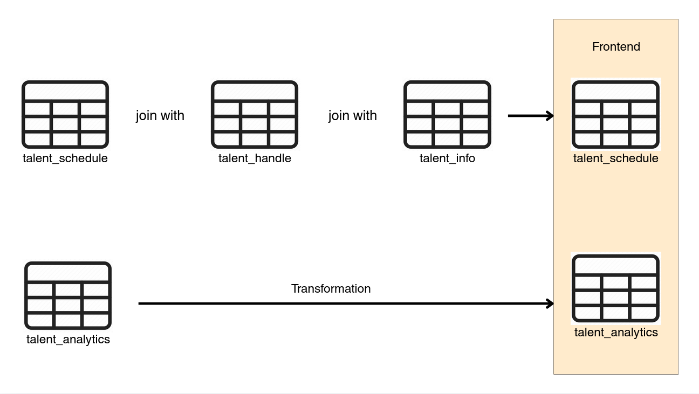

# HLCT Airflow DAGs

DAG definitions for the [Hololive Content Tracker](https://github.com/JYNgithub/Hololive-Content-Tracker) data pipeline, orchestrated via a self-hosted Apache Airflow instance.

## Pipelines

| DAG | Schedule | Description |
|-----|----------|-------------|
| `hololive_schedule_pipeline` | Hourly | Scrapes Hololive website for upcoming scheduled streams |
| `hololive_talent_pipeline` | Weekly | Scrapes static talent info (name, birthday, height, etc.) |
| `hololive_analytics_pipeline` | Daily | Fetches YouTube livestream analytics via Data API |

## Stack

- **Orchestration**: Apache Airflow 2.11.2
- **Scraping**: Selenium + [Chromium](https://googlechromelabs.github.io/chrome-for-testing/) (headless)
- **Data**: pandas, SQLAlchemy, Neon (PostgreSQL)

## Prerequisites

- **Secrets**: A `.env` file with `DB_URL` and `YT_API_KEY` credentials
- **Configuration**: `config.yaml` defining paths and URLs per project
- **Chromium**: Headless Chromium and chromedriver binaries installed on the host